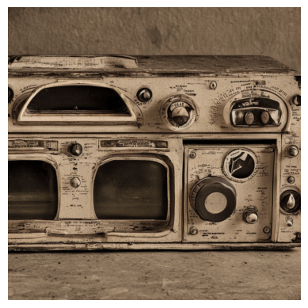
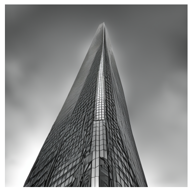
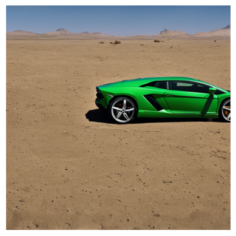

# ImageGen Project

A Python-based image generation project using `Stable Diffusion 2.1` to create AI-generated images from text descriptions.

## Generated Samples
#### Prompt 1 : A radio

#### Prompt 2 : A skyscrapper

#### Prompt 3 : A green lamborghini in the dessert



## Features

- Text-to-image generation using state-of-the-art Stable Diffusion 2.1
- GPU-accelerated inference for faster image generation
- Memory-optimized with attention slicing
- Configurable image resolution and generation parameters
- Automatic image saving functionality

## About the Model
This model is a Diffusion-based text-to-image generation model developed by Robin Rombach, Patrick Esser. This model that can be used to generate and modify images based on text prompts. It is a Latent Diffusion Model that uses a fixed, pretrained text encoder.

## Limitations
- The model does not achieve perfect photorealism
- The model cannot render legible text
- Faces and people in general may not be generated properly.
- The model was trained mainly with English captions and will not work as well in other languages.
- The autoencoding part of the model is lossy


## Requirements

- Python 3.x
- CUDA-capable GPU
- Required Python packages (see `requirements.txt`)

## Installation

1. Clone the repository:
   ```bash
   git clone [your-repo-url]
   cd ImageGen_Project
   ```

2. Create and activate a virtual environment:
   ```bash
   python -m venv .venv
   .venv\Scripts\activate  # On Windows
   ```

3. Install dependencies:
   ```bash
   pip install -r requirements.txt
   ```

4. Install the appropriate version of pytorch for your system from the pytorch website: https://pytorch.org/get-started/locally/.

5. Create a hugging face account at https://huggingface.co/

6. Generate a hugging face token and paste it in your terminal after running this command:

   ```bash
   huggingface-cli login```
## Usage

1. Ensure your virtual environment is activated
2. Run the script:
   ```bash
   python image-gen-script.py
   ```

The script will generate images based on the prompts defined in the script. 

## Configuration

The script includes several configurable parameters:

- `num_inference_steps`: Controls the generation quality (default: 50)
- `guidance_scale`: Controls prompt adherence (default: 7.5)
- `height/width`: Output image dimensions (default: 1000x1000)

## Project Structure

```
ImageGen_Project/
├── image-gen-script.py    # Main generation script
├── requirements.txt       # Project dependencies
├── model_cache/          # Cached model files
└── .venv/                # Virtual environment
```

## Model Details

Uses the Stability AI Stable Diffusion 2.1 model with the following optimizations:
- float16 precision for memory efficiency
- DPMSolverMultistepScheduler for improved generation quality
- Attention slicing for reduced memory usage


